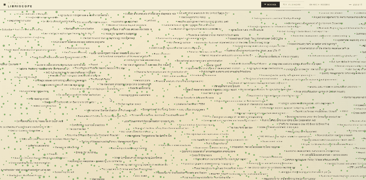

# Libriscope

Semantic map of books and authors.
When you select a work, it returns its nearest neighbors in embedding space.

Raw OpenLibrary dumps are at https://openlibrary.org/developers/dumps



## Quick start

```bash
make install                                  # ETL dependencies
make db-init                                  # create or sync the schema
make process-data                             # raw dumps to TSV chunks
make etl ARGS="--max-works 500000 --reset"    # ingest and embed
make author-embeddings                        # author centroids
make map-coords                               # PCA projection
make map-grids                                # LOD aggregates
make axis-labels                              # quadrant labels
make backend-build
make backend-run                              # serves on :8080
make frontend-install
make frontend-dev
```

Set `DATABASE_URL` and `EMBEDDINGS_MODEL` in `.env`.

## Components

1. **ETL**: It streams TSV chunks of the OpenLibrary dump, keeps kind of works with English titles via fasttext, resolves author keys to names, embeds each work locally with sentence-transformers, and writes to Postgres.
2. **Database**: It stores metadata, vectors under an HNSW cosine index, 2D coordinates, and lod grid aggregates.
3. **Backend**: It handles recommendations, search, and map tiles.
4. **Frontend**: It renders the map, requests viewport tiles at the right lod for the zoom, and handles selection and searching.

[docs/deployment.md](docs/deployment.md) covers setup. 
[docs/model.md](docs/model.md) for the more indepth info about the current model embeddings.